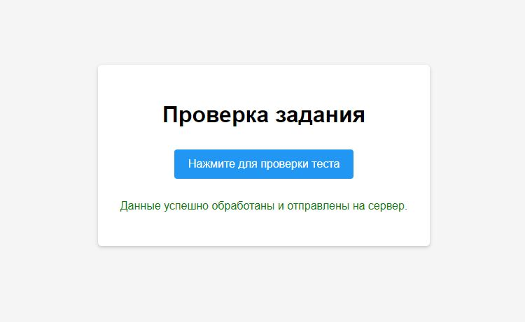

## Тестовое задание: Docker-контейнер для Python-скрипта  

Задание по ссылке: https://github.com/Raiffeisen-DGTL/DevOps-Bootcamp/tree/main/containerization.  

### Результат:  

Созданы [Dockerfile](https://github.com/OborinMaxim/devops-bootcamp/blob/e28a116554be972add0b9b5d1dfc84103ec603fa/Containerization/Dockerfile) и [docker-compose.yml](https://github.com/OborinMaxim/devops-bootcamp/blob/e28a116554be972add0b9b5d1dfc84103ec603fa/Containerization/docker-compose.yml) для предоставленного Python-скрипта. Контейнеры успешно запускаются через `docker-compose up -d` и работают вместе, приложение Python работает на Flask и взаимодействует с Redis. Веб-страница отображается корректно, и после нажатия кнопки выводится подтверждение результата:

